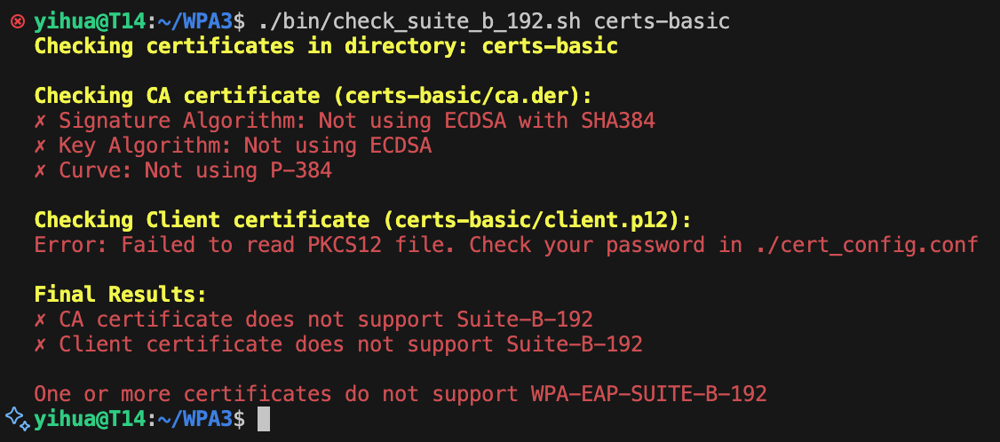
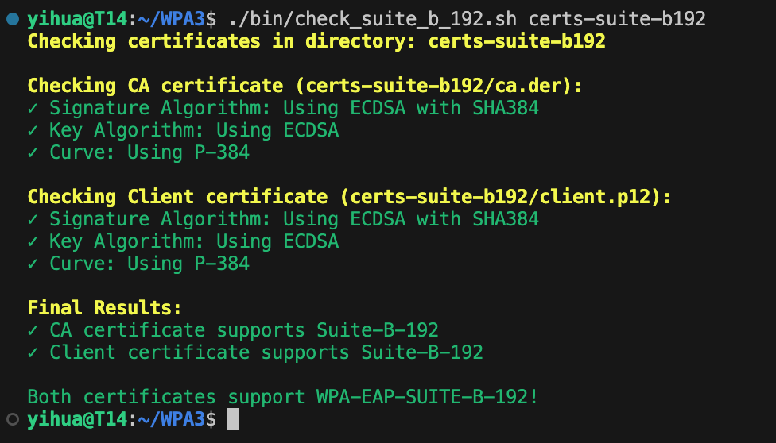

# WPA3 Certificate Tools

This project provides tools for checking and generating certificates for WPA3 Enterprise networks, specifically focusing on WPA-EAP-SUITE-B-192 support.

## Project Structure

```
.
├── bin/
│   └── check_suite_b_192.sh    # Certificate checking script
├── cert_config.conf            # Configuration file for certificate checking
├── certs/                      # Default directory for certificates to check
│   ├── ca.der                 	# CA certificate to check
│   └── client.p12            	# Client certificate to check
├── certs-basic/               	# Standard FreeRADIUS certificate configurations
│   ├── Makefile              	# Original certificate generation rules
│   ├── ca.cnf                	# CA certificate configuration
│   ├── server.cnf            	# Server certificate configuration
│   ├── client.cnf            	# Client certificate configuration
│   ├── xpextensions          	# X509v3 extensions configuration
│   └── passwords.mk          	# Certificate passwords configuration
├── certs-suite-b192/         	# SUITE-B-192 compatible certificate configurations
│   ├── Makefile              	# Modified for SUITE-B-192 support
│   ├── ca.cnf                	# Modified to use ECDSA P-384
│   ├── server.cnf            	# Modified to use ECDSA P-384
│   ├── client.cnf            	# Modified to use ECDSA P-384
│   ├── xpextensions          	# X509v3 extensions configuration
│   └── passwords.mk          	# Certificate passwords configuration
└── README.md
```

## Certificate Checker Results Example

### Non-compliant Suite-B-192 Certificates
Using standard RSA certificates for checking:


### Compliant Suite-B-192 Certificates
Using ECDSA P-384 certificates for checking:


## Certificate Configurations

The project includes two sets of certificate configurations:

1. **certs-basic/**: Contains original FreeRADIUS certificate configurations
   - Standard RSA-based certificates
   - Compatible with regular WPA3 Enterprise setups

2. **certs-suite-b192/**: Contains modified configurations for WPA-EAP-SUITE-B-192
   - Uses ECDSA with P-384 curve (secp384r1)
   - Uses SHA-384 signature algorithm
   - Includes appropriate certificate policies and key usage extensions
   - Meets Suite-B-192 requirements

### Generating Certificates

To generate Suite-B-192 compatible certificates:

1. Go to the certs-suite-b192 directory:
   ```bash
   cd certs-suite-b192
   ```

2. Clean any existing certificates:
   ```bash
   make destroycerts
   ```

3. Generate new certificates:
   ```bash
   make all
   ```

This will generate:
- CA certificate (ca.pem, ca.der)
- Server certificate (server.pem, server.p12)
- Client certificate (client.pem, client.p12)
- All necessary keys and CSRs

## Certificate Checker

### Requirements

- OpenSSL installed on your system
- Certificates to check:
  - CA certificate in DER format
  - Client certificate in PKCS12 format

### Configuration

Edit `cert_config.conf` in the project root to set your PKCS12 certificate password:

```bash
# Configuration for certificate checking
PKCS12_PASSWORD=your_password_here
```

### Usage

1. Make sure the script has execution permissions:
   ```bash
   chmod +x bin/check_suite_b_192.sh
   ```

2. Run the checker with a specific directory:
   ```bash
   ./bin/check_suite_b_192.sh [directory]
   ```

   Examples:
   ```bash
   # Check certificates in the default certs/ directory
   ./bin/check_suite_b_192.sh

   # Check certificates in certs-basic/ directory
   ./bin/check_suite_b_192.sh certs-basic

   # Check certificates in certs-suite-b192/ directory
   ./bin/check_suite_b_192.sh certs-suite-b192
   ```

   The script expects to find:
   - `ca.der` - CA certificate
   - `client.p12` - Client certificate
   in the specified directory

### What it Checks

The script verifies if your certificates meet WPA-EAP-SUITE-B-192 requirements:

1. ECDSA with P-384 curve
2. SHA-384 signature algorithm

For each certificate, it checks:
- Signature Algorithm (must be ECDSA with SHA384)
- Key Algorithm (must be ECDSA)
- Curve Type (must be NIST P-384)

### Output Format

The script provides colorized output indicating:
- ✓ Green: Requirement met
- ✗ Red: Requirement not met
- Yellow: Informational messages

### Exit Codes

- 0: All certificates support Suite-B-192
- 1: One or more certificates do not support Suite-B-192 or error occurred

### Troubleshooting

1. If you see "Error: Configuration file not found":
   - Make sure `cert_config.conf` exists in the project root directory
   - Check file permissions

2. If you see "Error: Directory not found":
   - Verify the specified directory exists
   - Check directory permissions

3. If you see "Error: Certificate file not found":
   - Verify certificates exist in the specified directory
   - Check file permissions
   - Verify filenames match expected names (ca.der, client.p12)

4. If you see "Error: Failed to read PKCS12 file":
   - Check if the password in `cert_config.conf` is correct
   - Verify the PKCS12 file is not corrupted
